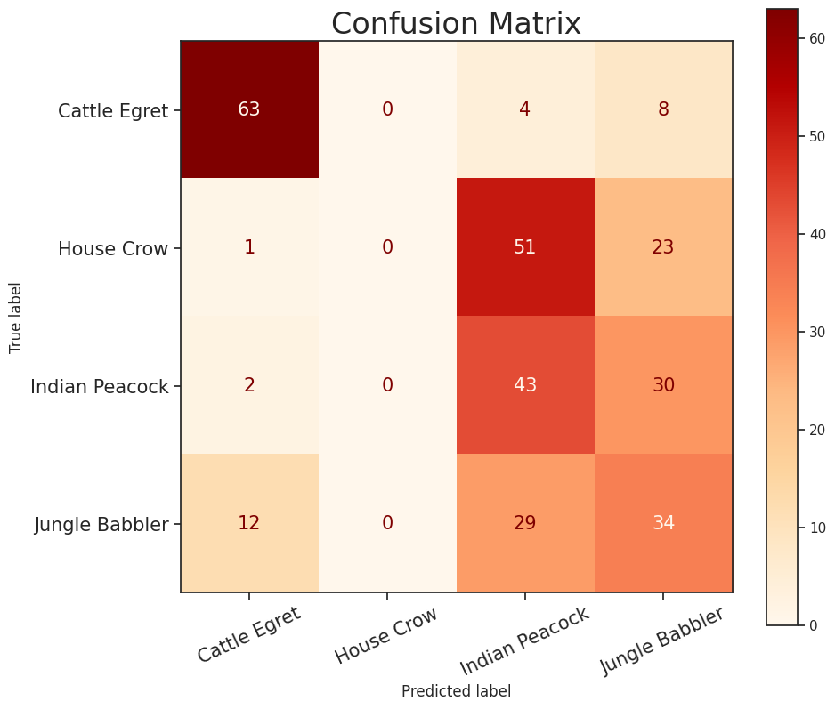
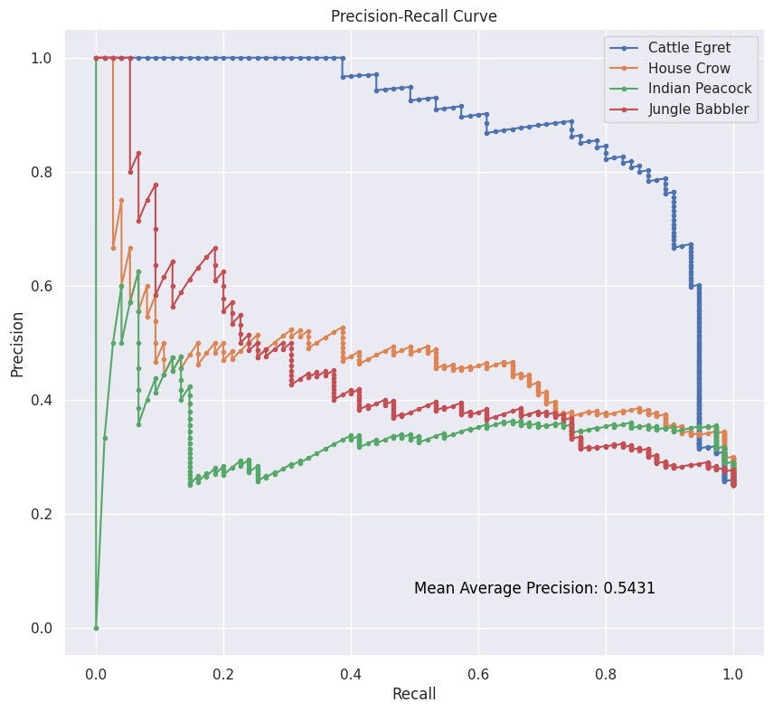
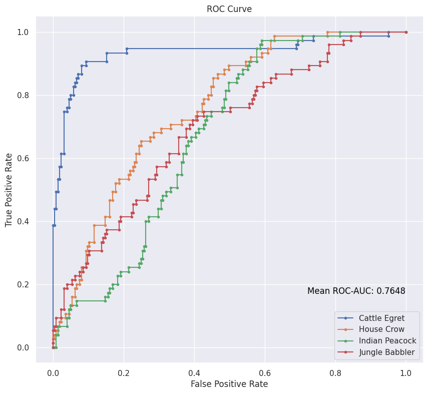

# VGG Implementation

 
 

Welcome to the VGG (Visual Geometry Group) implementation repository! Here, you'll find an implementation of the VGG architecture using TensorFlow. VGG is a popular deep convolutional neural network architecture known for its simplicity and strong performance in image classification tasks.

## What is VGG?

VGG is a convolutional neural network architecture proposed by the Visual Geometry Group at the University of Oxford in their paper "Very Deep Convolutional Networks for Large-Scale Image Recognition" (2014). The network is characterized by its uniform architecture, consisting of multiple layers of 3x3 convolutional filters followed by max-pooling layers. VGG is widely used as a baseline for various computer vision tasks and has been influential in the development of deep learning models.

## Features

* Implementation of the VGG architecture from scratch using TensorFlow.
* Pre-trained VGG models for image classification tasks.   [`vgg-19.h5`]()
* Simple API for training, testing, and evaluating the VGG model.
* Visualization and analysis tools to understand model performance.

## Matrics

### Confusion Matrix

The accuracy of our model (i.e., VGG-19) on Testing Data (which contains 75 images belonging to 4 classes each) is **46.667%** over 100 epochs.

## Precision-Recall Curve

Mean Average Precision (mAP) is **0.5431**

## ROC-AUC Curve

Mean ROC-AUC score is **0.7648**

